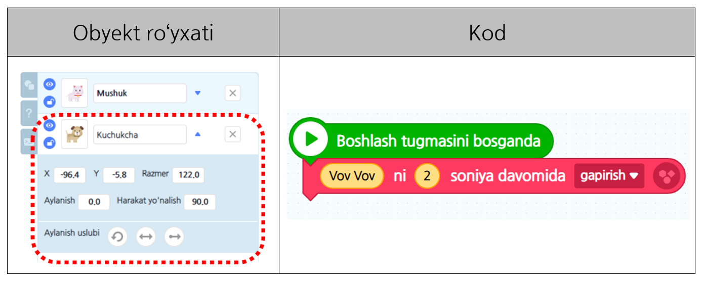
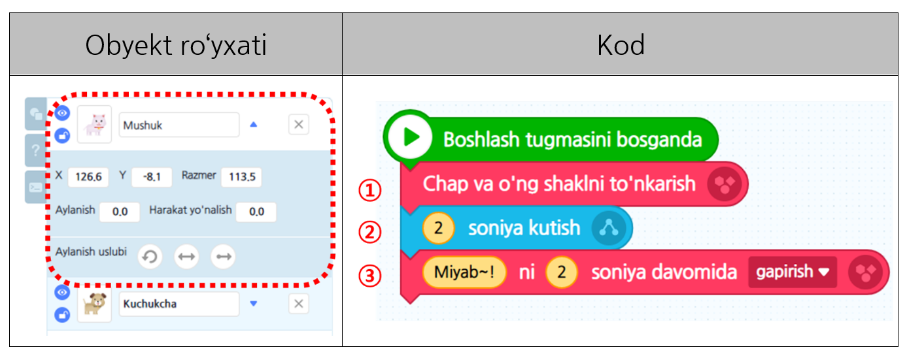
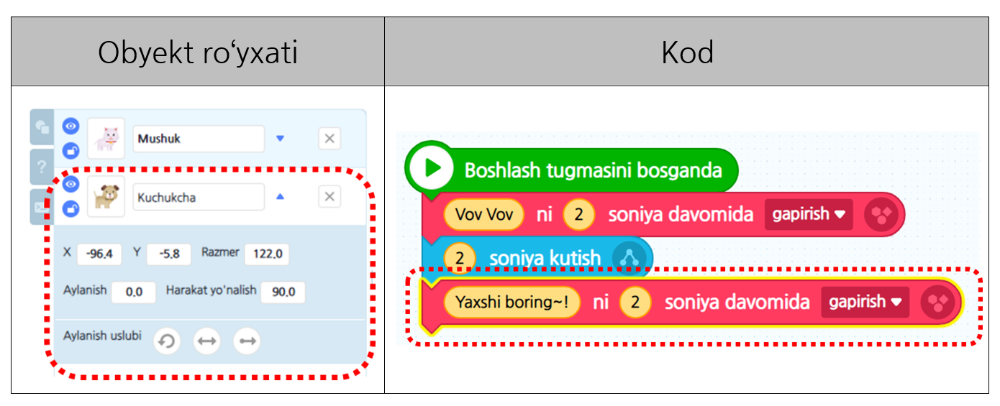
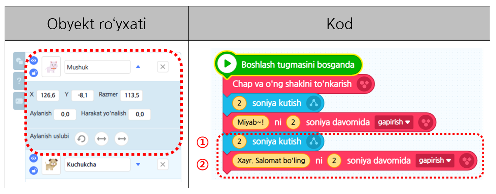

# 1-misol\_"Ketma-ketlik"

Maktabda do’stlaringiz bilan rangli qog’ozdan narsalar yasab ko’rganmisiz? Unda qog’ozdan narsa yasash kitobiga qarab, tartib bilan sekin-asta oxirgi natijani tayyor qilib boramiz. Shu tarzda ketma-ketlikda tartib bilan bajarilgan amal _**‘Ketma-ketlik’**_ deb ataladı. Ushbu darsda ketma-ketlik amalidan foydalanib kuchuk bilan mushukni gaplashtirib ko’ramiz.

### 1.Ekranda kerak bo’lmagan ‘Entrybot’ obyektini o’chirib ‘Obyektni qo’shish’ tugmasini bosing.

### 2. Kuchukcha bilan mushukcha obyektini tanlab ‘Qo’shish’ tugmasini bosing.

### 3. Obyekt ro’yxati sahifasida qalam tugmasini bosib, obyektning nomini tahrirlang.

### 4. Sichqoncha ko’rsatkichidan foydalanib, obyektning hajmini kattalashtiring.

### 5. Kuchukcha obyektini tanlab, kuchukcha birinchi bo’lib mushukcha bilan salomlashadigan qilib ‘Ko’rınısh’ kategoriyasidan “–nı soniya davomida gapirish” blokini olib keling. 

### 6. Mushukcha ham javoban salomlashishi uchun mushuk obyektini tanlang. Mushukcha kuchukchaga yuzma-yuz qaraydigan qilib ‘Ko’rınısh ’kategorıyasıdan “Chap va o'ng shaklni to’nkarish ” blokini olib keling.①

#### Kuchukcha 2 soniya davomida salomlashgani uchun mushukcha 2 soniya davomida navbatini kutadi.②

#### ①,② 1 va 2 amallari tugaganidan so’ng kuchukcha bilan salomlashadi. 

### 7. Hozir esa xayrlashish vaqti keldi. Kuchukcha birinchi bo’lib “Oqim” kategoriyasidagi “–ni sekund davomida gapirish” blokidan foydalanib xayrlashadi.

### 8. Mushukcha ham kuchukcha xayrlashgan paytida kutib turib\(①\) kuchukcha bilan xayrlashadi.\(②\)

### 9. Loyihani bajargan bo’lsangiz, sarlavhani xohlagancha nomlab “Saqlash” tugmasini bosing.

####  ※ A**maliyot \(**[**https://bit.ly/3wTJR3I**](https://bit.ly/3wTJR3I)**\)**



