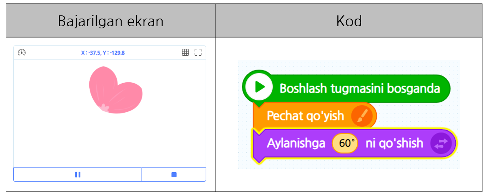
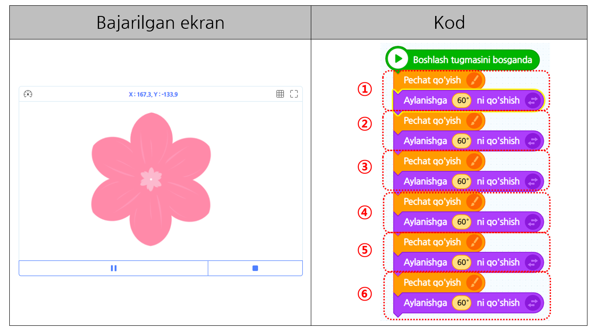
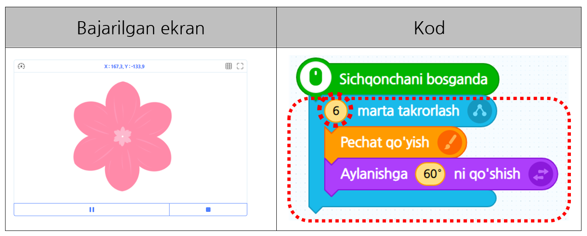

# 2-misol\_"Takrorlash"

O'tgan darsda _"Ketma-ketlik'"_haqida o'rgangan bo'lsangiz, ushbu darsda _"**Takrorlash"**_ tushunchasi to'g’risida bilib olamiz. Yo'lda yurib borayotganingizda yo'l chetida chiroyli gullarni ko'rganmisiz? Agar e'tibor bergan bo'lsangiz , bir xil shakldagi barglar takrorlanib gulning markazida hosil bo'lgan. Ushbu darsda takrorlash tushunchasi orqali chiroyli gulni yasab ko’ramiz. Unday bo’lsa “Entry” orqali _**"Takrorlash"**_ nı o’rganib ko’ramizmi?

### 1. Pushti rang gul bargi obyektini qo'shing.

### 2. Gulni yasash uchun gul bargining shakli bir xil bo'lib, lekin burchaklari\(gradusi\) farq qilishi kerak.  

### Shunga asoslanib, \[Cho'tka\] kategoriyasidagi "Pechat qo'yish" bloki bilan \[Harakat\] kategoriyasidagi "Aylanishga - ni qo'yish" blokini olib kelib, ketma-ket qo’yıng.

### _**※ Diqqat:**_ 

#### _**Gul bargi aylanishi uchun obyektning markazini harakatlantirishingiz kerak. Markazning joyidan kelib chiqib natija ham boshqacha chiqadi.**_

### 3. Faqat ikkita gulning bargi bilan gul yasay olmaysiz, to'g'rimi? Gulni yasash uchun bir nechta gul bargi kerak bo’ladi. Shuning uchun gul bargini pechat qilishga 6 marta qilamiz.

### 4. Ekranga qaraganingizda kodlar juda uzun emasmı? Ekranda bır xıl bo’lgan kodlar 6 marta takrorlangan. Hozir barglarning soni unchalik ko’p bo’lmagani uchun tezda bajarishingiz mumkin, lekin quyidagi kod 100 marta takrorlansa “Gul bargini chizish” ni 100 marta qilsangiz judayam samarasiz bo’ladi. Shuning uchun yanada tez va oson bir nechta gul bargini yasamoqchi bo’lsangiz \[Oqim\] kategoriyasidagi “-- marta takrorlash” blokını olib keling. Undan so’ng blokning son qismini “6”ga o’zgartirib dasturni ıjro ettirib ko’ring. “Takrorlash” blok orqali chiroyli gul yasadingiz. Endi esa gulning rangi bilan toifasini o'zgartirib ko'ring.

### 5. Sichqonchani bosganingizda gulning rangi o’zgarishi uchun mavjud bo’lgan gulni o’chiring.\(①\) \[Ko’rinish\] kategoriyasidan “Rang ta’sirini – dan berish” blokini olib kelib gulning rangini o’zgartirib ko’ring.\(②\)

#### ※ A**maliyot \(**[**https://bit.ly/2OKVJ6Y**](https://bit.ly/2OKVJ6Y)**\)**



