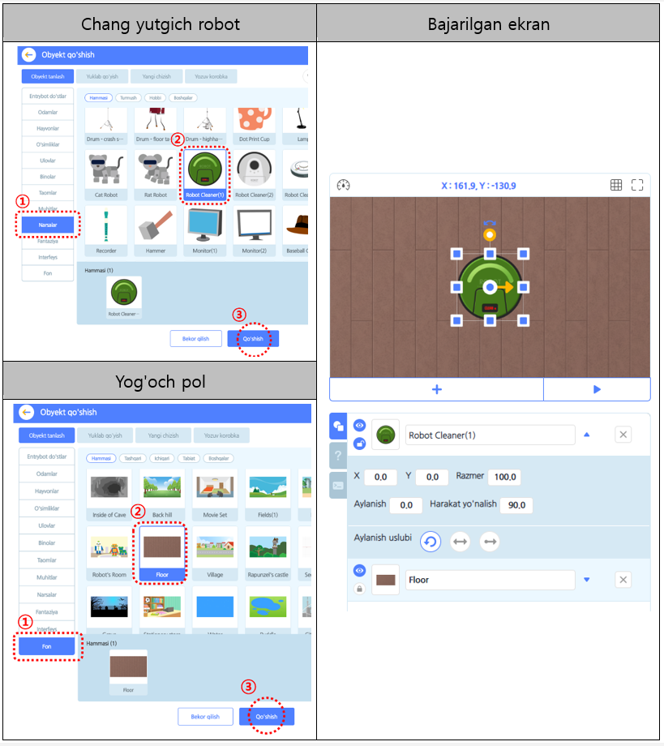
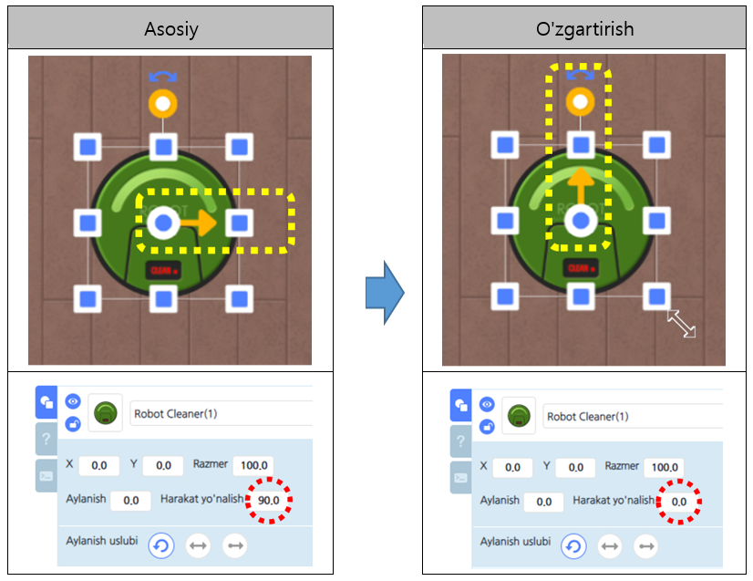
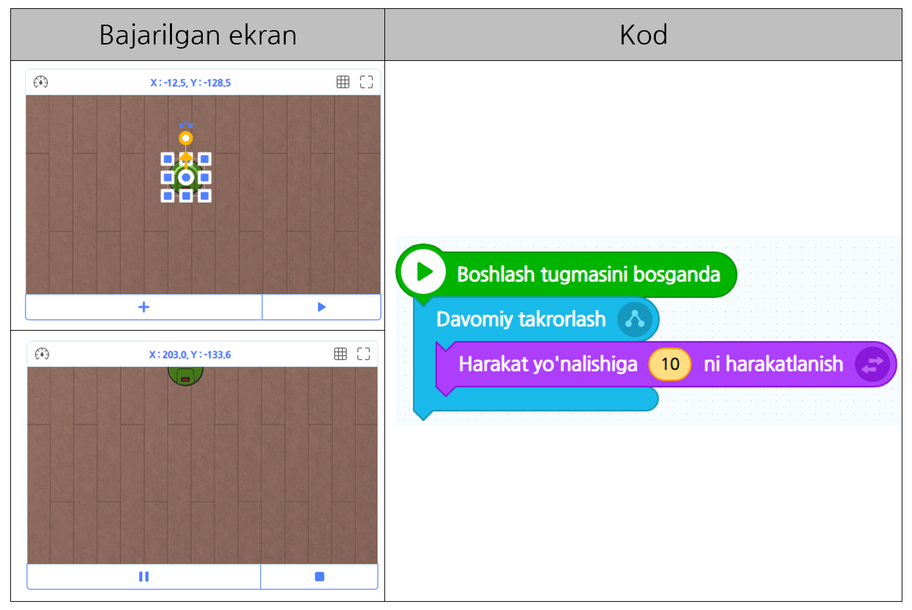
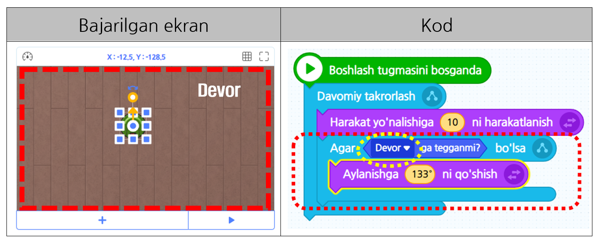
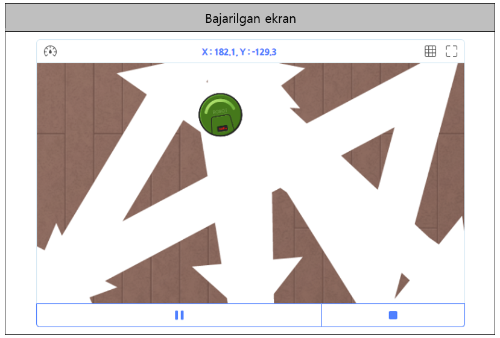
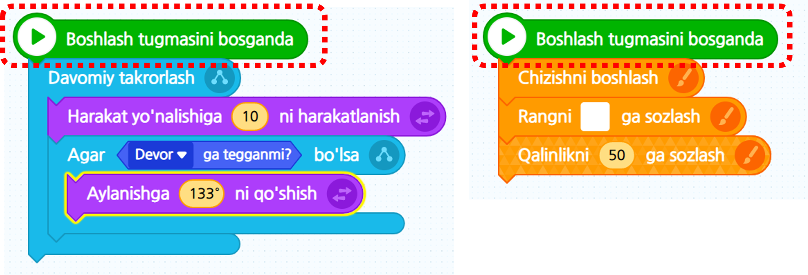

# 3-misol\_"Shart"

Changyutgich robotini ko'rganmisiz? Chang yutgich roboti oldinga qarab harakatlanayotganida to'siqni uchratsa, harakatini o'zgartiradi. Ushbu darsda _"Tanlash"_  tushunchasidan foydalanib, changyutgich robotiga xonaning burchaklarini tozalashda yordam berib ko’ramiz.

### 1. Ekranda "Yog'och pol" orqa foni va "Chang yutgich robot" obyektini qo’yamiz.

### 2. "Chang yutgich robot" obyektini tanlang va kodni quyidagi rasmga o’xshatib qo'ying.

### 3. Sichqonchadan foydalanib harakat yo'nalishi ko’rsatgichini aylantirib changyutgich robotni oldingi tarafga harakatlanadigan qilib qo’ying. Keyin esa changyutgich robotning hajmini yetarli darajada qisqartiramiz.

### 4. Changyutgich robot polni\(yerni\) davomiy tozalaydigan qilib \[Oqim\] kategoriyasidagi “Davomiy takrorlash” bloki bilan \[Harakat\] kategoriyasidagi “Harakat yo’nalishini – dan ko’chirish” blokidan foydalaning.

### 5. Changyutgich robot poldan chiqib ketib qayergadir ketayapti. Changyutgich robot poldan chiqib ketmasligi uchun nima qilishimiz kerak? Ha, to'g’ri shart qo’yishimiz kerak. Qizil chiziqda aks etilgan sirtqi qism – bu devor. Shunaqa qilib changyutgich robot devorga teggan paytida poldan chiqib ketmaydigan qilib kodni tuzib ko’ramiz. \[Oqim\] kategoriyasidagi “Agar – bo’lsa” bloki bilan \[Qaror\] kategoriyasidagi “— ga tegganmi?” blokini ketma-ket qo’yamiz. Shu joyda biroz to’xtang! Changyutgich robot pol to’liq tozalangunicha uzluksiz harakatlanishi kerak. Shuning uchun “Davomiy takrorlash”ni blokning ichiga kirgizamiz. safiga qo’shamiz. 

※ Foydali maslahat: “Agar – bo’lsa” blokiga shart blokini kirgizgan paytingizda blokning chap uchini birlashtirsangiz blok oson yig’iladi.

### 6. “Boshlash”ni bosib changyutgich robot iflos polning burchaklarini tozalayaptimi to’liq tekshirib ko’ramiz.

### 7. Eng oxirgi kod. Shu joyda ozgina to’xtang. Oldindan yaratilgan changyutgich robotning yo’lini\(marshrutini\) chizadigan kod bilan bizlar yaratgan changyutgich robotni harakatga keltiradigan ikki xil kodlar bir vaqtning o’zida ijro bo’lmoqda. Bundan kelib chiqib, bir obyekt ikki xildan ortiq kodlarni bir vaqtning o’zida ijro etishi mumkinligini bilib oling!

#### ※ Amaliyot \( [https://bit.ly/2RxSeC2](https://bit.ly/2RxSeC2) \)



