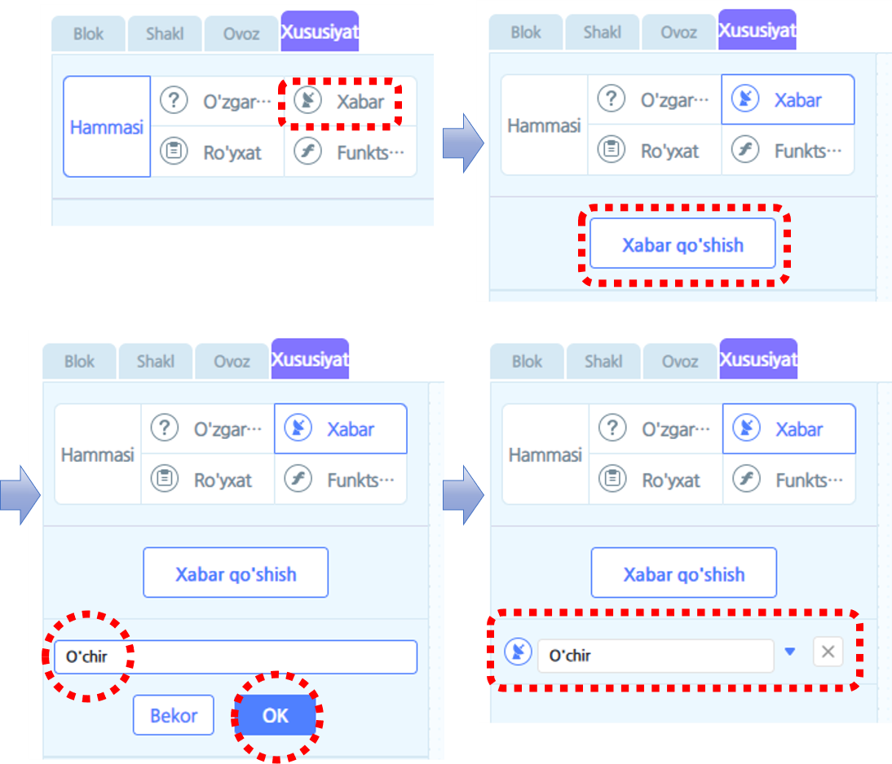
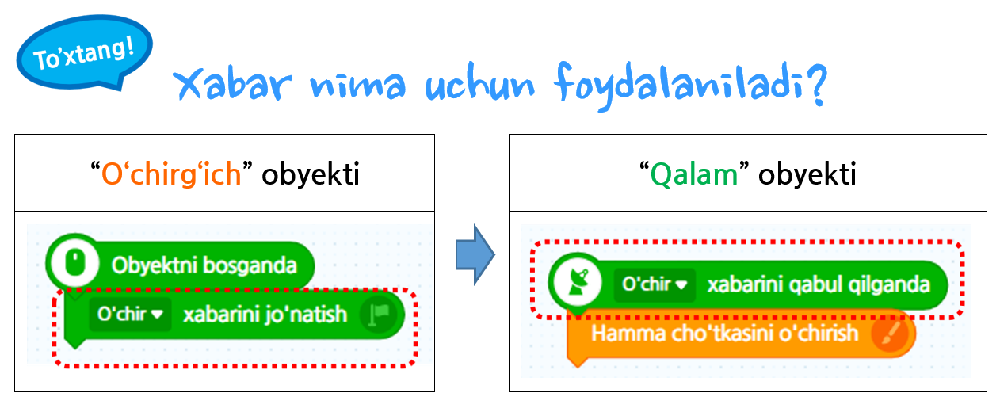
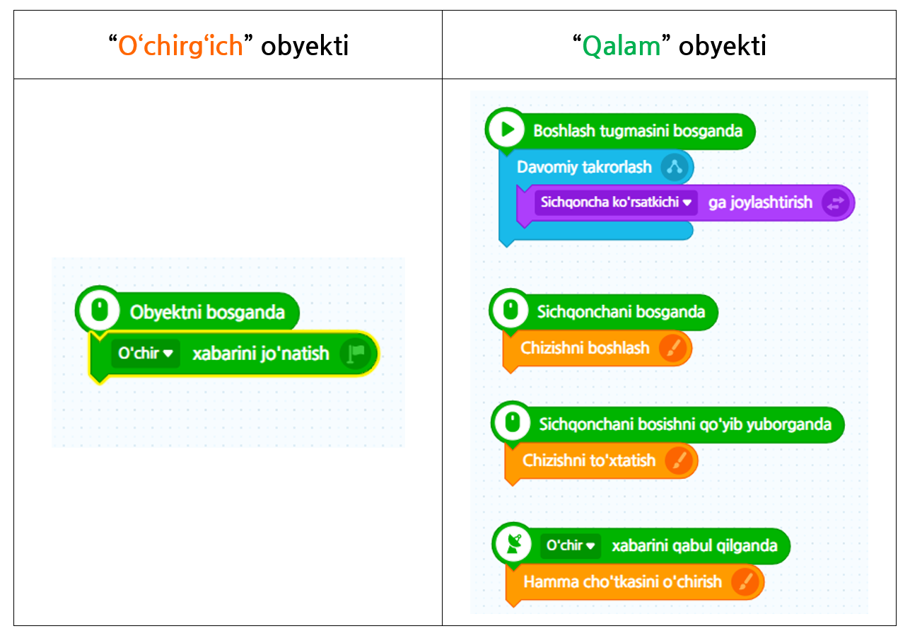

# 4-misol\_"Xabar"

Dars vaqtida yoki kompyuter ishlatayotganingizda “Rasm taxtasi” degan dastur orqali bir marta bo’lsa ham rasm chizib yoki shunchaki chizmalab ko’rgan bo’lishingiz kerak. Ushbu darsda o’zingizning rasm taxtangizni o’zingiz yasab ko’rib _**“Xabar”**_ haqida o’rganasiz.

### 1. Ekranda “Qalam” va “O’chirg’ich” obyektlari berilgan.

### 2. Qalamning o’rtasida joylashgan markaz nuqtasini qalamning uchiga ko’chirib qalam davomiy sichqonchaning izidan harakatlanadigan qilib quyidagi kabi bloklarni ketma-ket qo’ying.

### 3. Sichqonchani bosgan paytingizda qalam obyekti rasm chizib, bekor qilganingizda chizishni to’xtatishi kerak, shuning uchun quyidagi kabi bloklarni yig’ib ko’ramiz.

### 4. Qalam orqali rasm chizib o’chirg’ich orqali o’chiradigan loyihani yaratib ko’ramiz. Buni yaratish uchun bugun ushbu darsda eng muhum tushuncha bo’lgan _"Xabar"_ to'g’risida o’rganamiz. Tasmali panelidagi \[Xususiyat\] ni tanlab “O’chir” degan xabarni qo’shamiz.

 _Bizlar “O’chirg’ich” obyektini bosganimizda, “Qalam” chizgan rasmlarning barchasi o’chirilishi kerak. Shundan kelib chiqib, qalam obyekti bilan o’chirg’ich obyekti o’rtasida o’zaro ta’sir bo’lishi uchun xabar foydalaniladi._

### 5. Quyida berilgan oxirgi kodga qarab, qalam va o’chirg’ich orasida xabarni  almashadigan uslub va rasm taxtasi qanday qilib namoyon bo’ladiganligini yana bir marotaba tekshirib ko’ramiz.

#### ※ Amaliyot \([https://bit.ly/3spYmcp](https://bit.ly/3spYmcp)\)



