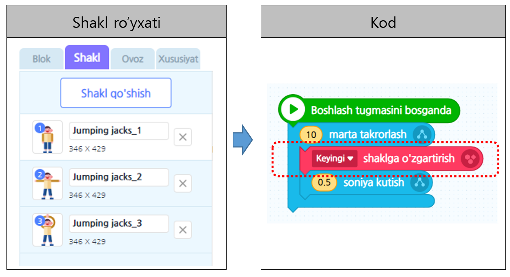
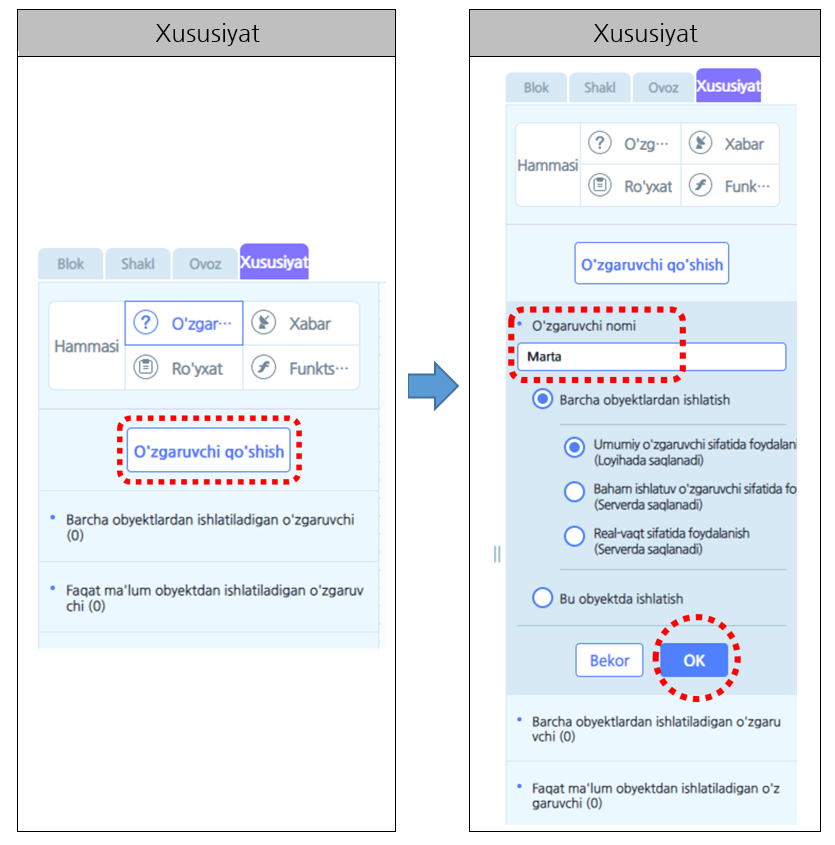
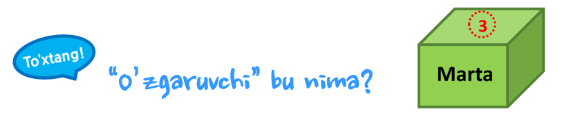
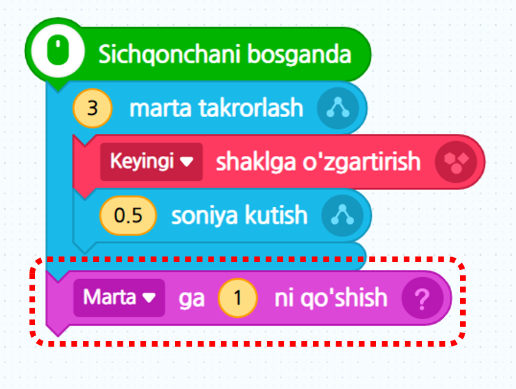

# 5-misol\_"O’zgaruvchi"

Bola qo’lini yoyib sakrab sport bilan shug’ullanmoqchi. Turli xil obyektlarning shaklini o’zgartirib qo’lni yoyib sakrashni ifodalab ko’ramiz. Qo’lni yoyib sakrash sonini qanaqa qilib ifodalasa bo’ladi? _**“O’zgaruvchi”**_ dan foydalanib bolaning necha marta qo’lini yoyib sakraganligini sanab ko’ramizmi?

### 1. Ekranda “Sportchi bola” obyekti ko’rsatilgan.

### 2. “Sichqonchani bosganda” bola qo’lini yoyib sakray oladigandek qilib tasmali penelidagi \[Shakl\] ni tanlab uyerda joylashgan shakllardan foydalanamiz. Quyidagi kabi shakllarni almashtirib qo’lni yoyib sakrashni ifodalaymiz.

### 3. Lekin bola qo’lini yoyib sakrash mashqini qancha marta bajarganligini bilmaymiz. Bolaning necha marta qo’lini yoyib sakrash mashqini bajarganligini sanash uchun o’zgaruvchidan foydalanamiz.

### **“O’zgaruvchi” bu nima?** 

O’yinlardagi “ball”, raqam daftarchasidagi “Mening ismim” ga o’xshagan ma’lumotlarni kompyuter xotirasida saqlashi uchun nima qilishimiz kerak? “O’zgaruvchi” shunaqa ma’lumotlarni saqlash mumkin bo’lgan joydir. O’zgaruvchiga erkin ravshda nom qo’yib va dasturning ijro jarayonida qiymatni kiritish, o’zgartirish, o’chirish amallarini qilishimiz mumkin. Bir o’zgaruvchida sonli yoki yozuv qiymatini bir martada faqat bir donadan saqlash mumkinligini esingizda tuting!

### 4. O’zgaruvchini qo’shganingizda ijro ekranida quyida ko’rsatilganday ko'rinadi hamda \[Xususiyat\] dagi o’zgaruvchi “Marta”ni bossangiz asosiy qiymati 0ga qayta yuklanganini tasdiqlashingiz mumkin.

### 5. Eng oxirida sonini\(marta\) sanagan paytingizda harakatni tamomlaganidan so’ng sonini\(martasini\) sanashingiz kerak. Bundan kelib chiqib, bloklarning oxirida \[O'zgaruvchi\] kategoriyasidagi “- ga - dan qo’shish” blokini olib kelib ketma ket qo’ying.

※ Amaliyot \( [https://bit.ly/2PTELUN](https://bit.ly/2PTELUN) \)



