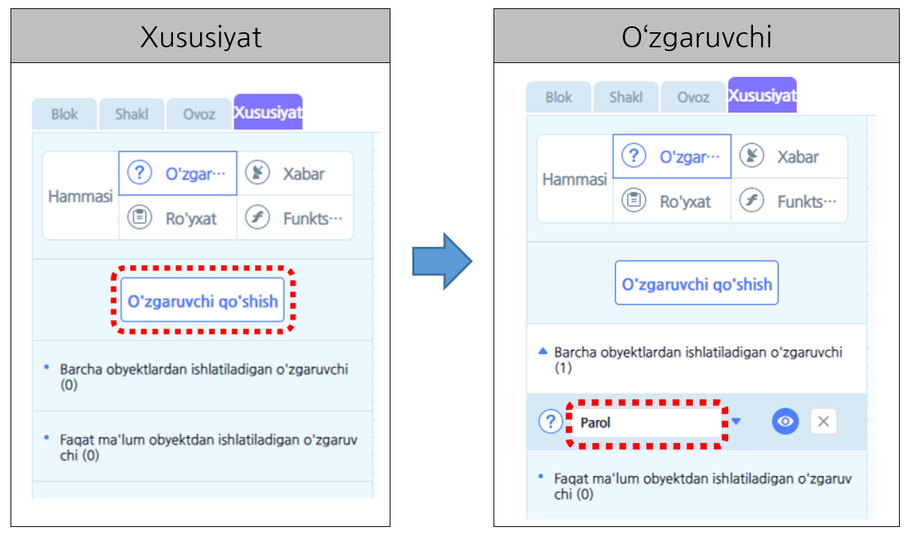
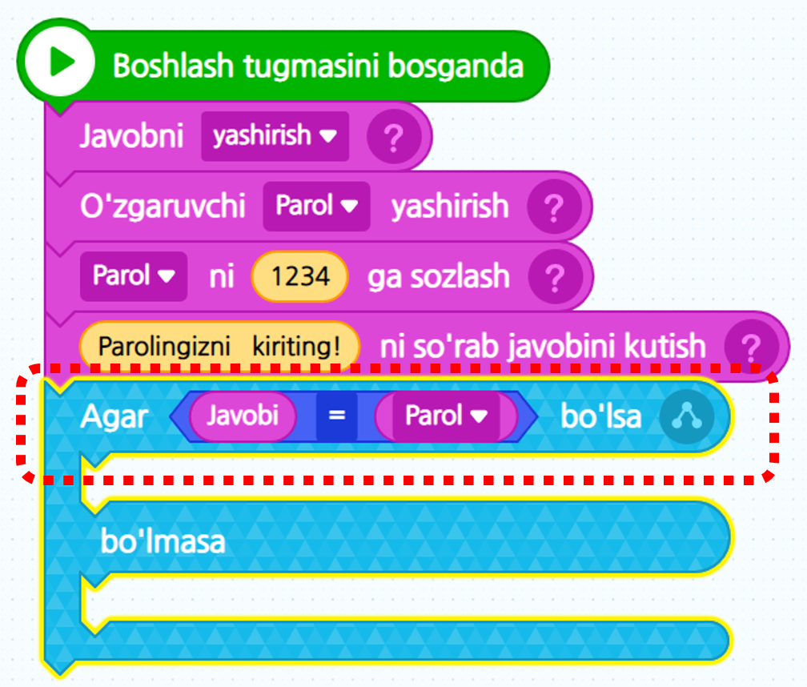
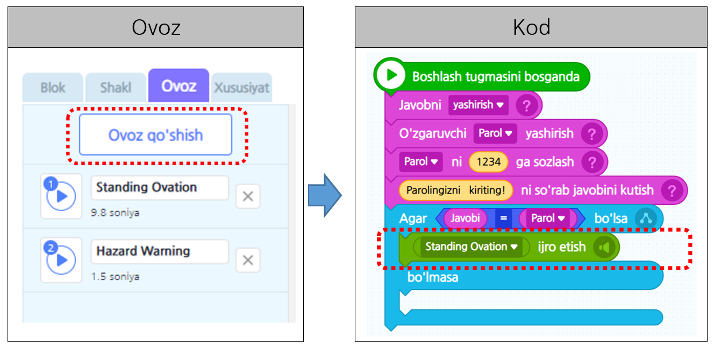
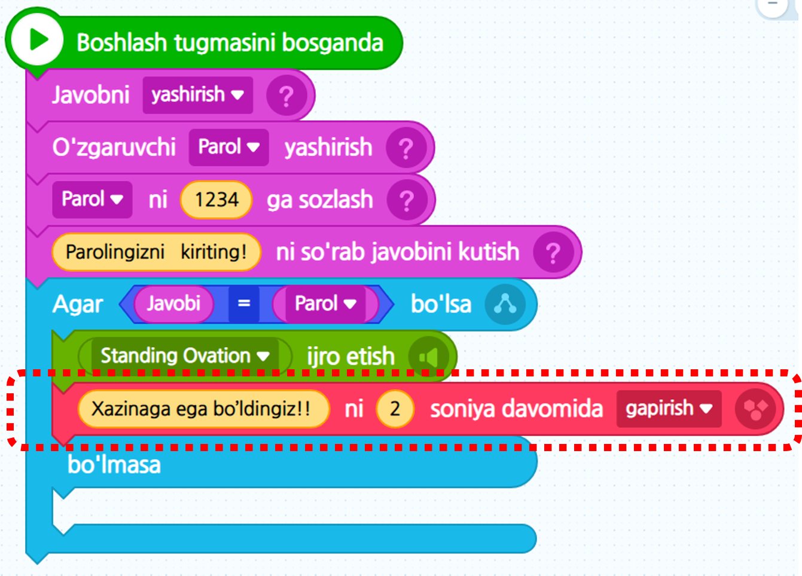
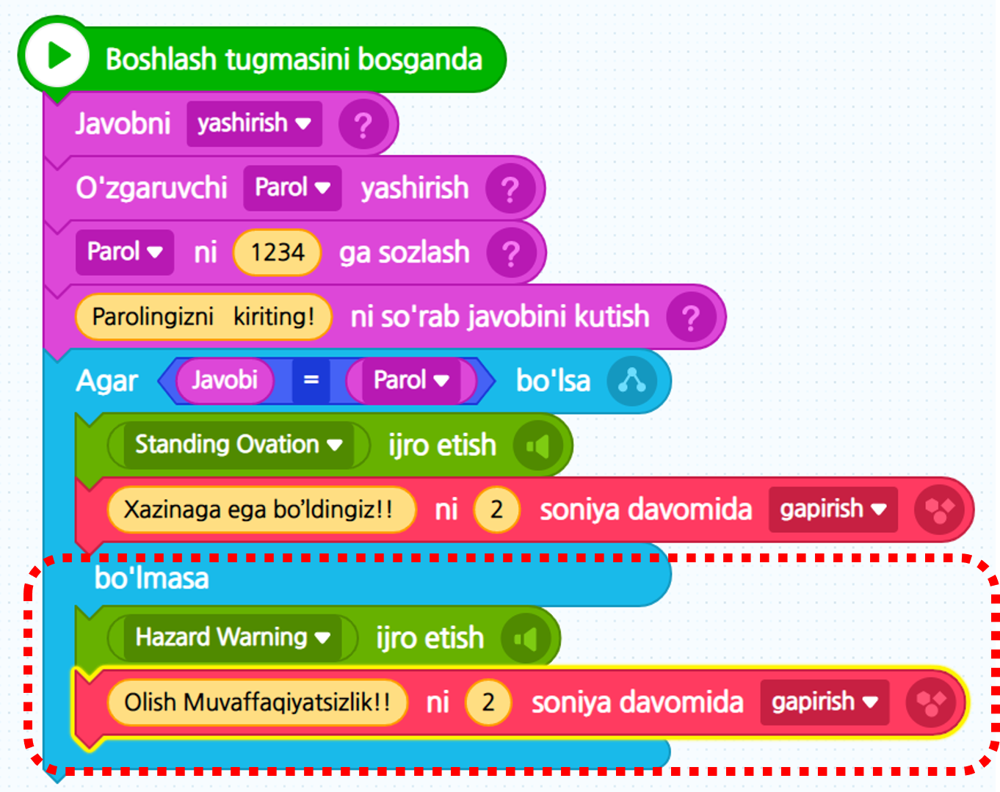

# 6-misol\_"Kiritish va chiqarish"

Uyingizga kirgan paytingizda kalit o’rniga foydalaniladigan elektron qulfning asosini bilib olish qiziq emasmi? Xazina qutisiga parol apparatini ishlab chiqib ushbu darsdagi muhim tushuncha bo’lgan “O’zgaruvchi” dan foydalangan holda elektron qulf qanday asos orqali ishlashini bilib olamiz.

### 1. Ekranda “Cho’l” bilan “Xazina qutisi” berilgan.

### 2. O’zgaruvchidan foydalanib xazina qutisini ochib ko’ramiz. 

Xazina qutisining parolini saqlaydigan joy – “Parol qiymati” degan o’zgaruvchi kerak bo’ladi. “Xususiyat” sahifasiga kirib o’zgaruvchini qo’shishni bosib “Parol qiymati” degan o’zgaruvchini yaratamiz.

### 3. “Parol qiymati” o’zgaruvchisi ekranda ko’rsatilsa bo’lmaganligi sababli uni yashirib,\(②\) xohlagan parol qiymatini tuzamiz.

\(③\) Hamda parolni so'raydigan "~ni so'rab javobini kutish" blokini ketma-ket qo'yamiz.\(④\)

O’yinlardagi “ball”, raqam daftarchasidagi “Mening ismim” ga o’xshagan ma’lumotlarni kompyuter yodida saqlashi uchun nima qilishimiz kerak? “O’zgaruvchi” shunaqa ma’lumotlarni saqlash mumkin bo’lgan joy. Xazina qutisini ochish uchun o’zingiz bosgan parol bilan “parol qiymati”ni solishtirishingiz kerak, to'g’rimi? Shunaqa qilish uchun kompyuter parol qiymatini yodida saqlab turishi kerakligi sababli o’zgaruvchidan foydalaniladi. 

O’zgaruvchiga erkin ravishda nom qo’yishingiz mumkin. Masalan, hozir bizlar yasayotgan xazina qutisining algoritmida “Parol qiymati” – bu o’zgaruvchining nomi. Shuningdek ushbu o’zgaruvchi ichiga son yoki belgini bir marta bir donadan saqlashingiz mumkin.

### 4. Bizlar parolni bosganimizda qanday vaziyat kelib chiqadi? 

Parolni to'g’ri kiritsak xazina qutisini ochishimiz mumkin, noto'g’ri kiritsak parolni qaytadan kiritishimiz kerak bo’ladi. Bu ikki xil holatni avval o’rgangan “Shart” belgisidan foydalanib ifodalashimiz mumkin.

### 5. Agar Parolni to'g’ri kiritgan paytingizda, qarsak ovozi bilan birga xazinaga ega bo’lganlik haqida bildiradigan gapni qo’shib ko’ramizmi? 

“Ovoz” bo’limiga borsangiz, oldindan “Qarsaklar”\(Standing Ovation\) ovozi bilan “Ogohlantiruvchi signal” \(Hazard Warning\) ovozi qo'shilgan. \[Ovoz\] kategoriyasining \[Ovozni -qaytadan qo'yish\] blogi orqali qarsak ovozi chiqadigandek quyidagi kabi yig’ib ko’ramiz.

### 6. \[Ko’rinish\] kategoriyasidagi gapirish blokidan foydalanib “Xazinaga ega bo’ldingiz ” gapini qo’shing.

### 7. Oxirgi marta parolni to’g’ri kirita olmagan paytingizda 

“ogohlantiruvchi signal” ovoz ta’siri bilan “Olish Muvaffaqiyatsizlik!!” ni bildiradigan qilib quyidagi kabi bloklarni ketma-ket qo’ying.

