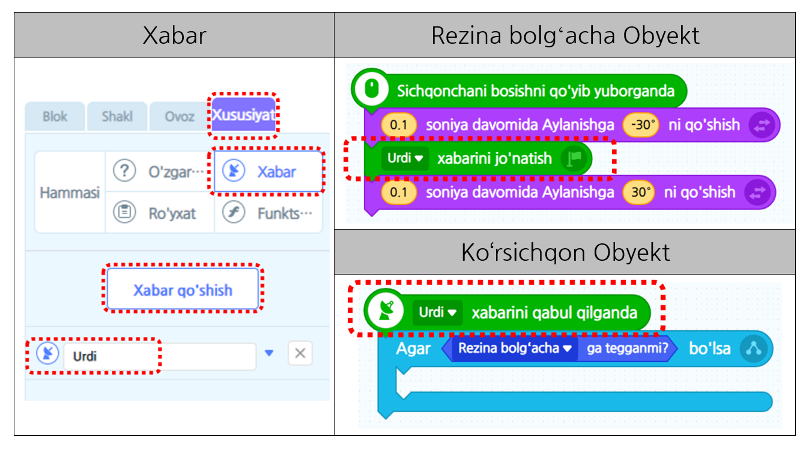
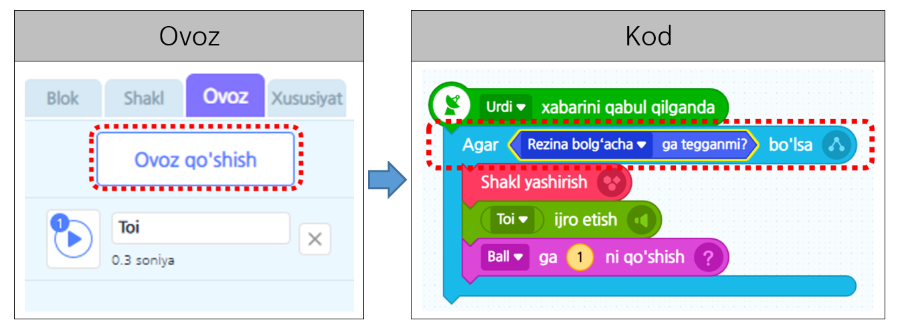

# 7-misol\_"Jamlash"

Ko’ngil ochar joyida bir marta bo’lsa ham qilib ko’rgan o’yiningiz “Ko’rsichqon” o’yinini yasab ko’ramiz. O’tgan darslarda o’rgangan “Ketma-ketlik”, “Takrorlash”, “Shart”, “Xabar”, “O’zgaruvchi”dan foydalanib qiziqarli “Ko’rsichqon” oyinini yaratib ko’ramiz.

### 1. Obyekt ro’yxatidan rezina bolgʻachasi obyektini tanlab rezina bolgʻachaning yo’nalishini bosib chap tarafga ozgina engashtiramiz.

### 2. Rezina bolgʻachasi sichqoncha ko’rsatkichini orqasidan davomiy ergashadigan qilib kodni ketma-ket qoying. 

#### Sichqonchani boskaningizda, rezina bolgʻachasi chap tarafga urganini aks etadi.

### 3. Avvalo, “Ko’rsichqon” obyektini tanlaymiz. 

“Ko’rsichqon” harakatga kelsagina rezina bolgʻachasi bilan ko’rsichqonni urish zavqli, tog’rimi? Buning uchun ko’rsichqon shakli ko’rinish va bekinish amallarini qilishi kerak. Ko’rsichqon harakatsizlikdan chiqishi kerak, shuning uchun \[Hisob\] kategoriyasidagi “-dan -o’rtasida harakatsizlik” blokini qo’yamiz.

### 4. Rezina bolg’achadan urilgan paytlarida “Ko’rsichqon” tarafidan urilganligini fikrlash  kerak. Binobarin “Urdi” xabarini yaratib rezina bolg’acha urgan paytida berilgan xabarni jo’natsak, ko’rsichqon rezina bolg’acha bilan urildimi fikrlay oladigan qilib kodni yasab ko’ramiz.

### 5. Rezina bolgʻachasi bilan ko’rsichqonni urganimizda qanday ishlar ro’y berishi kerak? 

Ovoz chiqadigan qilib ovozni qo’shib ko’ramiz. “Ovoz” sahifasiga kirib “Ovoz qo’shish”ni bosgandan so’ng “Toy” degan ovozni izlab qo’shamiz. Endi ko’rsichqonni urganimizda ko’rsichqonning shaklini yashirib ballga 1tadan qo’shadigan qilib quyidagi kabi bloklarni yig’ib ko’ramiz.

### 6. Ko’rsichqonni urganingizda ball ko’payadigan qilib bajarmoqchi bo’lsangiz dasturga ballni saqlash mumkin bo’lgan joy kerak bo’ladi. Shuning uchun O’zgaruvchi “Ball”ni qo’shing.

※ Fo’ydali maslahat\) O’zgaruvchini qo’shsangiz ijro ekranida o’zgaruvchan shakl paydo bo’ladi. Bu o’zgaruvchan shaklni sichqoncha bilan olib kelib xohlagan joyingizga harakatlatirishingiz mumkin.

### 7. Ko’rsichqonning hajmini yetarli darajada sozlab 

obyekt ro’yxatidagi ko’rsichqon obyekti ustiga sichqonchaning o’ng tarafidagi tugmani bosib bir necha ko’rsichqonni nusxalang. 

#### Foydali maslahat\) Obyektni nusxalasangiz berilgan obyekt ega bo’lgan kod, shakl va ovoz birgalikda nusxalanadi.

### 8. Nusxalangan ko’rsichqonlarni ekranga navbat bilan joylashtirib, 

rezina bolgʻachasi obyekti ro’yxatning eng yuqorisida joylashadigan qilib tepa tarafga olib kelib qo’yamiz.

