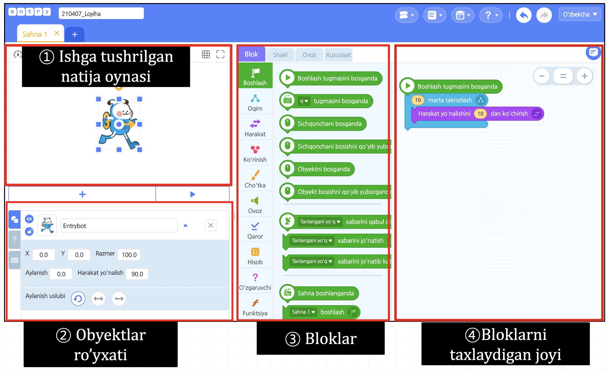

# Entryning Interfeysi

### Obyekt bu nima?

Obyekt – bu xuddi haqiqiy dunyodagi har bir mustaqillik bo'lgan obyektga o'xshaydi. Dasturiy dunyodagi obyektlar ham mustaqillik mavjudoti. Entryda obyetlar deganda misol uchun har qahramonlar, hatto orqa fonlar, yozuvlar ham obyekt bo'lish mumkin. Har bir obyek o'zining blok kodlar\(buyruqlarning to'plami\)ga ega va ko'pincha o'zida bir nechta ko'rinish shakllariga ega bo'ladi. Bloklar oynadagi tasmali paneli ichidagi 'Shakl' bo'limini bosib blokning ko'rinish shaklini o’zgartirish mumkin.

### 1. Ishga tushrilgan natija oynasi

Blok koding orqali dasturlashgan natijasi paydo bo’ladi. Yuqoridagi '+' tugmachani bir necha sahnalarni tashkil qilishingiz mumkin.

### **2. Obyektlar ro'yxat** 

Har bir sahnada ichda turgan hamma obyektlarning ro'yxati. Yuqoridagi '+' tugumachani bosib turli xil obyektlarni qo’shish mumkin.

### 3. Bloklar

Dasturlash tili sifatida ishlatiladigan bloklar mavjud. Dasturlash maqsadga qarab turli bloklarning bo'linmasini bosib bloklarni tanlash mumkin.

### 4. Bloklarni taxlaydigan joyi

Blokni birin-ketin joylashtirib dasturlash\(buyruqlar to’plami\)ni ishlab chiqadigan oynadir. Bloklarning shakli, turiga qarab buyruqlar yaratilib, yaratilgan buyruqlar asosida dastur ishlaydi

