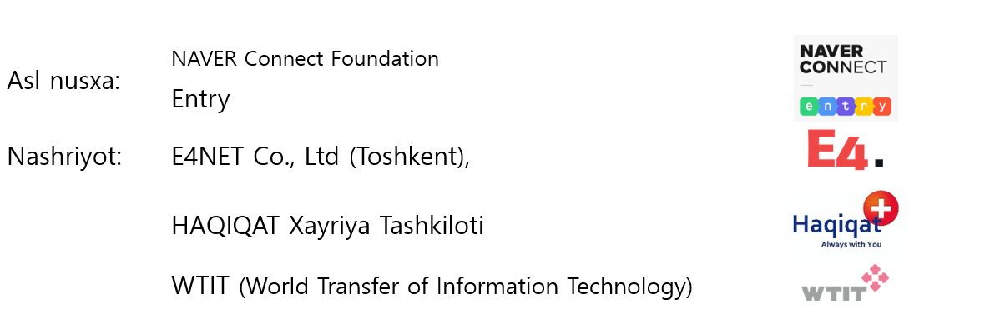

# Oxirgi xabar

Bu darslik bolalar dasturiy ta’minot ta’lim dasturi bo’lgan “Entry”ni yaxshilab tushunib organish uchun o’zbek tiliga tarjima qilindi. 

Bu kitob hamma be’pul dasturiy ta’minot ta’limini olishga yordam berish uchun ishlab chiqildi. 

Ushbu darslikni ishlab chiqishda yaqindan yordam berganlarga o’z minnadorchiligimizni bildiramiz.

Kirish Yozuvchi : JJ Lee 

Tarjimon: Abdiualieva Gulshat 

Tekshiruvchi: JJ Lee, Najimova Altinay 

Asl mualliflik huquqi: CC-BY

Asl nomi: [차근차근 따라하며 배우는 엔트리](https://playentry.org/material)

O'zg'artirilgan mazmun : Kirsh bo'lim qo'shish,  O'zbek tiliga tarjima qilingan

Hujjatlar o'zgartirish tarixi : 2021.4.21 BIrinchi nashr

Ushbu hujjatning mazmuni "Creative Commons" Attribution 2.0 Koreya litsenziyasi ostida ishlatiladi.. [http://creativecommons.org/licenses/by/2.0/kr/](http://creativecommons.org/licenses/by/2.0/kr/)

