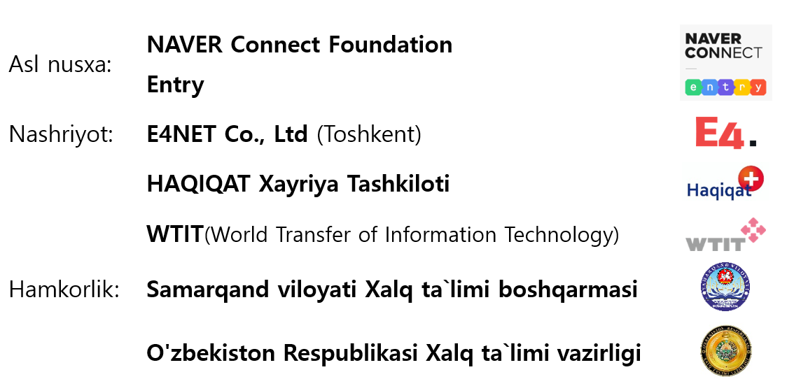

# Oxirgi xabar

Bu darslik bolalar dasturiy ta’minot ta’lim dasturi bo’lgan “Entry”ni yaxshilab tushunib o'rganish uchun O’zbek tiliga tarjima qilindi.

Bu kitob hamma bepul dasturiy ta’minot ta’limini olishga yordam berish uchun ishlab chiqildi.

Ushbu darslikni ishlab chiqishda yaqindan yordam berganlarga o’z minnadorchiligimizni bildiramiz.

**Qo'shimcha Yozuvchi** : JJ Lee, EuiHo Hong

**Tarjimon**: Abdiualieva Gulshat

**Tekshiruvchi**: JJ Lee, Najimova Altinay

**Asl mualliflik huquqi**: CC-BY

**Asl nomi**: [차근차근 따라하며 배우는 엔트리](https://playentry.org/material)

**O'zg'artirilgan mazmun** : O'zbek tiliga tarjima qilingan hamda Kirsh bo'lim va ba'zi joylarida yangi qo'shish

**Hujjatlar o'zgartirish tarixi** : 22-April, 2021 yili BIrinchi nashr

Ushbu kitobning mualliflik huquqini "Creative Commons Attribution 2.0 Koreya litsenziyasi" ostida ishlatiladi. [http://creativecommons.org/licenses/by/2.0/kr/](http://creativecommons.org/licenses/by/2.0/kr/)

