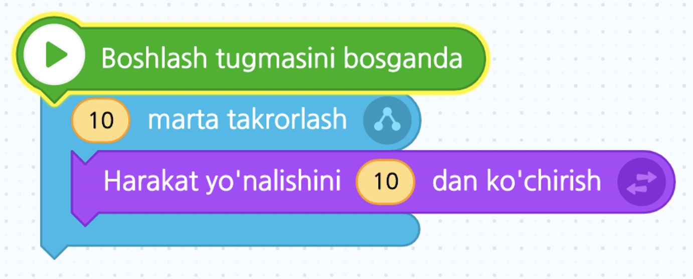
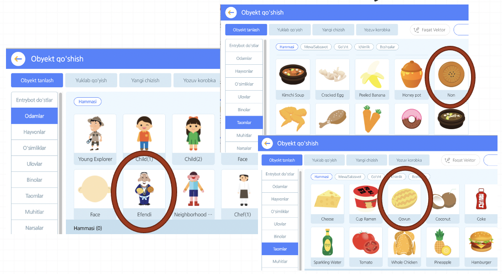
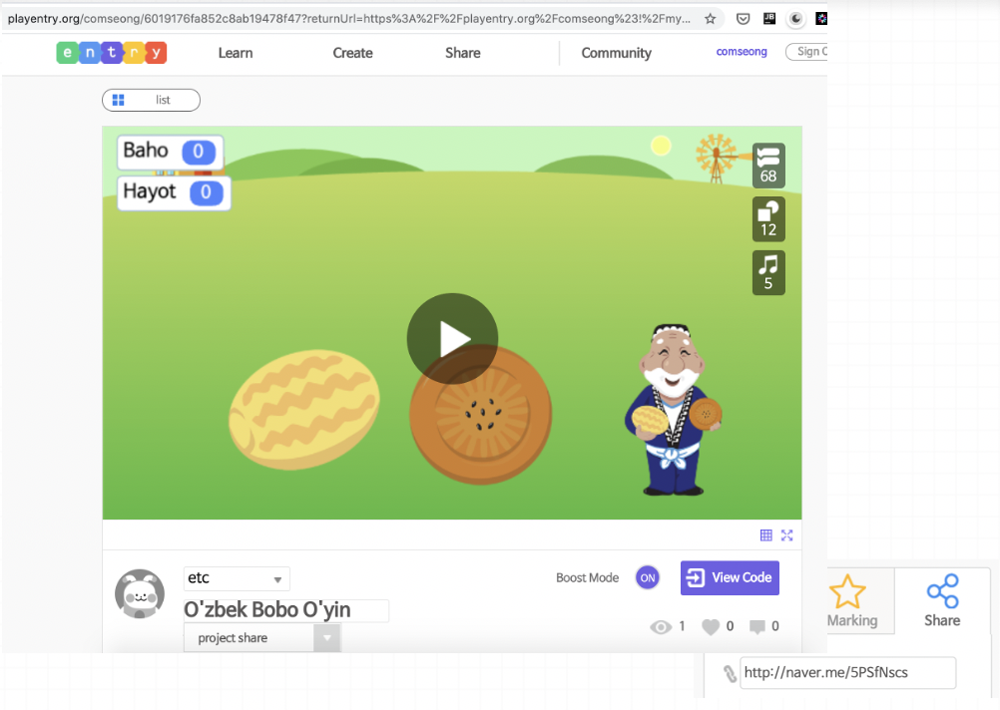
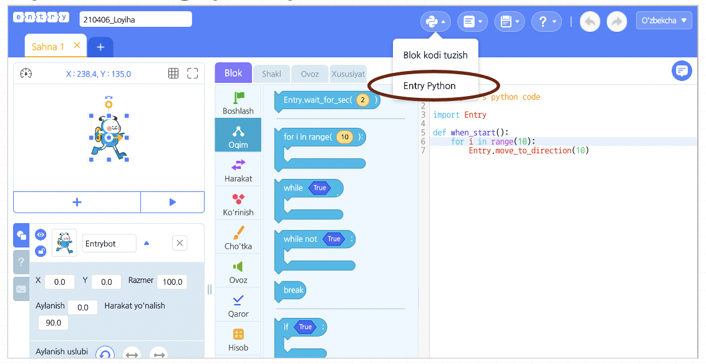
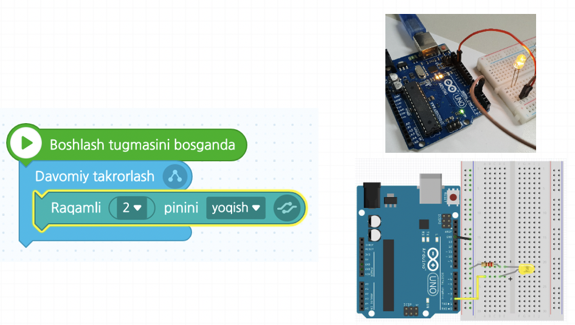

# Salom, Entry!

**Entry**, u dasturlashni o'rgatish uchun **Dasturlash tili**. Quyidagi rasmda ko’rsatilganidek '**Blok**\(buyruqlar\)' larni taxlab tartib bilan bajaradigan dasturini yaratadi. Bloklarni taxlab dasturlash jarayoni '**Blok koding**' deb ataladi.

**Blok kodingning afzaligi shundaki**, bloklar yordamida murakkab dasturlash tilini bilmaydigan endi boshlaganlar ham dasturlash tamoyillari va asoslarini osongina tushunishlari va dasturlashlari mumkin.

**Blok kodingning kamchiligi esa,** cheklangan ifodalardir. Bloklardan foydalanilishi bois taqdim etiladigan blok\(buyruqlar\)dan mustasno tarzda muayyan sozlamalar, turli xil ifodalardan foydalanib bo’lmaydi.

_Entry mavjud qiyin dasturiy yondashuvni emas, sodda va osonlikcha qabul qilsa bo’ladigan dasturiy yondashuvni tanlashi orqali, endi boshlaganlar va yosh bolalar ham dasturlashni o’rgansa bo’ladigan muhitni yaratib beradi._

### Entryning yaxshi xislatlari

#### Entry ichki milliy obyetlar

Yosh bolalar yaxshi tanish milliy obyetlarni ishlatib qiziqarli dasturlash mumkin.

#### Python dasturlashga ko'prik

Menudagi 'Entry Python' ni tanlab blok kodlarni Python tiliga aylantirib ko'rsatadi hamda u yerdan Python tilini ishlatib dasturlash mumkin. Entry ichida blok kodingdan boshlab haqiqiy dasturlash tiligacha o'tish mumkin.

#### Arduino dasturlashga ko'prik

Entrydagi Arduino uchun bloklarni ishlatib Arduino ni blok koding orqali o'rganish mumkin. Entry ichida blok kodingdan boshlab haqiqiy qurilmani boshqaradigan dasturlashgacha ko'prik bo'lish mumkin.

#### Arduino dasturlashga ko'prik

Entrydagi Arduino uchun blokla

