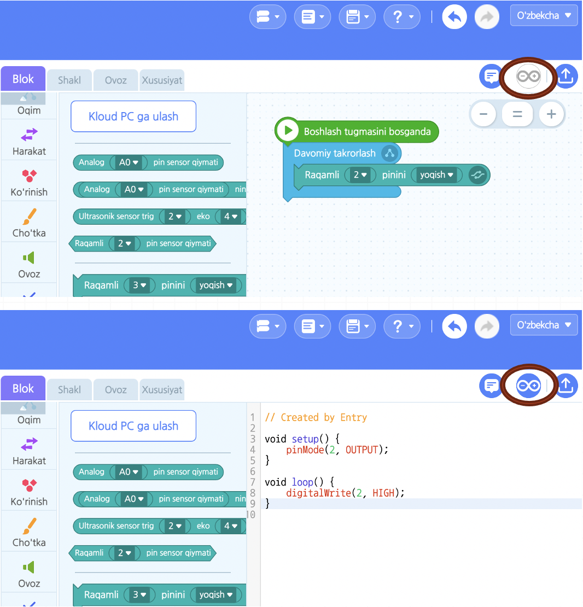

# Salom, Entry!

**Entry**, u dasturlashni o'rgatish yoki o'rganish uchun Koreyadan yaratilgan **Dasturlash tili**\(EPL: Educational Programing Language\)dir. Quyidagi rasmda ko’rsatilganidek '**Blok**\(Buyruqlar\)' larni taxlab dasturini yaratadi. Entryga o'hshash dasturlashni o'rgatish yoki o'rganish uchun eng mashuhur darturlash tili [Scratch](https://scratch.mit.edu)dir. Bloklarni taxlab dasturlash jarayoni '**Blok koding**' deb ataladi.

**Blok kodingning afzaligi shundaki**, haqiqiy dasturlash uchun text tillari\(Masalan, Python, C++ va hokazo\)ni bilmasdan ham bloklarning yordamidan dasturlashib dasturlarni yaratish mumkin. Dasturlashning asoslarini osonginadan tushunib olish mumkin.

**Blok kodingning kamchiligi esa,** haqiqiy dasturlash uchun text tillaridan ko'ra cheklangan ifodalardan iboratdir. Bloklardan foydalanilishi bois taqdim etiladigan blok\(buyruqlar\)dan mustasno tarzda turli xil ifodalardan foydalanib bo’lmaydi.

_Entry mavjud qiyin dasturiy yondashuvni emas, sodda va osonlikcha qabul qilsa bo’ladigan dasturiy yondashuvni tanlashi orqali, endi boshlaganlar va yosh bolalar ham dasturlashni o’rgansa bo’ladigan muhitni yaratib beradi._

## Scratchdan ko'ra Entryning yaxshi xislatlari

### Entry ichki milliy obyektlari

Yosh bolalar yaxshi tanish milliy obyetlarni ishlatib qiziqarli dasturlash mumkin.

### Python tiliga ko'prig'i

Menudagi 'Entry Python' ni tanlab blok kodlarini Python tiliga aylantirib ko'rsatadi hamda u yerdan Python tilini ishlatib dasturlash mumkin. Entry ichida blok kodingdan boshlab haqiqiy dasturlash tiligacha o'tish mumkin.

### Arduino C++ tiliga ko'prig'i

Entrydagi Arduino uchun tayyor bo'lgan ichki bloklarni ishlatib Arduinoni blok koding orqali o'rganish mumkin. Entry ichida blok kodingdan boshlab haqiqiy qurilmani boshqaradigan dasturlash tiligacha ko'prik bo'lish mumkin.

Hamda Arduino bloklarini Arduino C++ tiliga aylantirish ikonini bosib Entry ichida blok kodingdan boshlab haqiqiy dasturlash tiligacha o'tish mumkin. Undan tashqari Arduino C++ tiliga aylantirish ikoni yonidagi kodlarni qurilmaga yuklab qo'yish ikonini boshib o'zingiz dasturlashgan kodlarini Arduino ichidagi xotiraga saqlab qo'yish mumkin. Keyin Arduino o'zi Entry bilan ulanishga qaramasdan o'zining xotrasida saqlangan kodlar orqali bir o'zi ishlaydi.

### Arduinodan tashqari 60tadan ziyod qurilmalarni foydalanish

Texnik ta'minotini boshqaradigan dasturlashni o'rganish uchun Arduinodan tashqari 60tadan ziyod qurilmalar tayyor. Masalan, turli xil robotchalar, dron, mikrokontroller, mikrobit, lego ev3 va hokazo.

### Entryni yuklab olish: [https://github.com/JeongJun-Lee/entry-offline/releases](https://github.com/JeongJun-Lee/entry-offline/releases)

